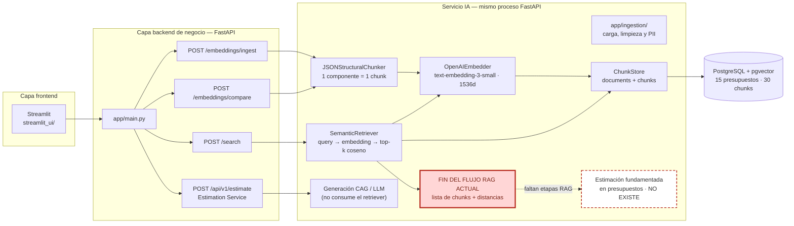
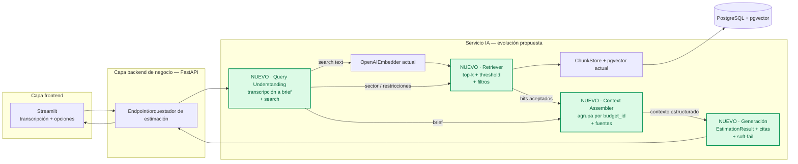

# Diagnóstico arquitectónico — Sesión 09 (pre-work)

Estado del servicio IA de `estimador-cag` al cierre de Sesión 08,
comportamiento observado al pasarle una transcripción cruda, cinco fallos
concretos y propuesta de evolución hasta cerrar el bucle transcripción →
estimación fundamentada.

> **Convención.** Las observaciones van en español; los comandos, payloads y
> nombres de campo en inglés. El trace de la sección 2 es reproducible: los
> comandos están puestos tal cual se ejecutan y la salida pegada es real. Los
> cinco fallos de la sección 3 se anclan a observaciones del trace, no a
> afirmaciones genéricas, y se etiquetan con la etapa del flujo RAG
> (`Query → Retrieval → Augmentation → Generation`) a la que corresponden.

## 1. Diagrama de la arquitectura actual



> Nota: en `estimador-cag` el backend de negocio y el servicio IA **viven en el
> mismo proceso FastAPI** (no son servicios separados como en la arquitectura
> canónica de tres capas); el diagrama los separa conceptualmente para mostrar
> las responsabilidades.

La ingesta y la búsqueda semántica están implementadas, pero forman un camino
separado de la generación existente. `POST /search` termina devolviendo chunks
y distancias; no hay un flujo implementado que transforme una transcripción,
recupere evidencia y la entregue a la generación para producir una estimación
fundamentada. La generación CAG actual existe (`POST /api/v1/estimate`) pero
**no consume el retriever**: por eso la flecha discontinua hacia "estimación
fundamentada" no tiene implementación detrás.

## 2. Trace anotado de `02_ambiguous.txt`

### Preparación y comprobación del corpus

Comandos ejecutados:

```bash
docker compose up -d postgres redis api

docker compose exec -T postgres psql -U estimator -d estimator \
  -c "SELECT count(*) AS documents FROM documents;
      SELECT count(*) AS embedded_chunks
      FROM chunks WHERE embedding IS NOT NULL;"
```

Respuesta:

```text
 documents
-----------
        15

 embedded_chunks
-----------------
              30
```

El corpus activo contiene los 15 presupuestos históricos esperados y 30 chunks
con embedding. Cada presupuesto aporta dos componentes.

Durante la preparación se observó una incidencia de ingesta reproducible. El
corpus original usaba rutas como `data/budgets/s07-fin-001.json`; al ejecutar
la ingesta idempotente con rutas como
`data/budgets_sample.json::S07-FIN-001`, la base pasó de 15 documentos y 30
chunks a 30 documentos y 60 chunks. Los presupuestos tenían el mismo
`budget_id`, pero el sistema los consideró distintos porque la deduplicación
solo compara `source_path`. Antes del trace se eliminó exclusivamente esa
segunda copia para restaurar la baseline de 15/30.

### Paso 1 — Embeber la transcripción completa

El script cliente se ejecutó dentro de un contenedor efímero para usar el
mismo entorno y credencial que la API:

```bash
docker compose run --rm \
  -e ESTIMATOR_BASE_URL=http://api:8000 \
  -v "$PWD/examples:/app/examples:ro" \
  api python examples/trace_s09.py examples/transcripts/02_ambiguous.txt
```

Salida real del primer paso:

```text
STEP 1 - embedding of the full transcript
transcript      : examples/transcripts/02_ambiguous.txt
model           : text-embedding-3-small
dimensionality  : 1536
L2 norm         : 1.000350
first component : 0.006248
last component  : 0.019028
```

Este único vector representa a la vez venta online, fidelización, panel de
gestión, stock, pagos, Francia, email de confirmación y conversación social.
Su
norma confirma que es un embedding normalizado, pero no indica que haya
conservado la prioridad de cada necesidad; semánticamente funciona como un
promedio de señales distintas.

### Paso 2 — Búsqueda semántica (top-5)

Llamada HTTP reproducible equivalente al segundo paso del script:

```bash
curl -sS -X POST http://localhost:8000/search \
  -H "Content-Type: application/json" \
  -d "{\"query\": $(jq -Rs . < examples/transcripts/02_ambiguous.txt),
      \"k\": 5}" | jq
```

Resumen real:

```text
search_time_ms  : 530
results         : 5

rank  chunk_id  distance  sector     budget_id
   1         8    0.6315  ecommerce  S07-ECO-001
   2        14    0.6391  ecommerce  S07-ECO-004
   3         7    0.6394  ecommerce  S07-ECO-001
   4        12    0.6449  ecommerce  S07-ECO-003
   5        13    0.6473  ecommerce  S07-ECO-004
```

Respuesta JSON real. El campo `query`, que la API devuelve como eco literal, es
exactamente el contenido de `examples/transcripts/02_ambiguous.txt`; se omite
aquí para no duplicar toda la transcripción.

```json
{
  "k": 5,
  "search_time_ms": 530,
  "results": [
    {
      "chunk_id": 8,
      "document_id": 4,
      "chunk_type": "budget_component",
      "content": "[Project: Marketplace modernization for catalog search, promotions, checkout, and seller inventory synchronization.]\n[Client sector: ecommerce | Year: 2024 | Main tech: Next.js]\n\nComponent: Responsive checkout\nDescription: Create a multi-step checkout experience optimized for mobile buyers. The flow includes shipping options, payment selection, order review, and abandoned cart resilience.\nTech stack: Next.js, React, Stripe\nComplexity: high\nEstimated hours: 150",
      "distance": 0.6315244260219004,
      "metadata": {
        "year": 2024,
        "budget_id": "S07-ECO-001",
        "complexity": "high",
        "component_id": "checkout-ui",
        "client_sector": "ecommerce",
        "estimated_hours": 150,
        "main_technology": "Next.js"
      }
    },
    {
      "chunk_id": 14,
      "document_id": 7,
      "chunk_type": "budget_component",
      "content": "[Project: Fashion retail platform with personalized recommendations and seasonal campaign landing pages.]\n[Client sector: ecommerce | Year: 2024 | Main tech: React]\n\nComponent: Campaign landing page builder\nDescription: Give marketing teams reusable sections for seasonal landing pages. Editors compose product grids, editorial banners, and call-to-action blocks without code changes.\nTech stack: React, TypeScript, CMS\nComplexity: medium\nEstimated hours: 110",
      "distance": 0.6391312554684436,
      "metadata": {
        "year": 2024,
        "budget_id": "S07-ECO-004",
        "complexity": "medium",
        "component_id": "campaign-builder",
        "client_sector": "ecommerce",
        "estimated_hours": 110,
        "main_technology": "React"
      }
    },
    {
      "chunk_id": 7,
      "document_id": 4,
      "chunk_type": "budget_component",
      "content": "[Project: Marketplace modernization for catalog search, promotions, checkout, and seller inventory synchronization.]\n[Client sector: ecommerce | Year: 2024 | Main tech: Next.js]\n\nComponent: Product catalog search\nDescription: Build a searchable product catalog with filters for brand, category, availability, and price. The feature synchronizes seller updates and exposes fast query responses for storefront pages.\nTech stack: Next.js, Elasticsearch, Node.js\nComplexity: high\nEstimated hours: 140",
      "distance": 0.6393645692658358,
      "metadata": {
        "year": 2024,
        "budget_id": "S07-ECO-001",
        "complexity": "high",
        "component_id": "catalog-search",
        "client_sector": "ecommerce",
        "estimated_hours": 140,
        "main_technology": "Next.js"
      }
    },
    {
      "chunk_id": 12,
      "document_id": 6,
      "chunk_type": "budget_component",
      "content": "[Project: Online store for cycling equipment with same-day delivery scheduling and returns management.]\n[Client sector: ecommerce | Year: 2023 | Main tech: Django]\n\nComponent: Returns self-service portal\nDescription: Allow customers to request returns, select pickup times, and print labels. Support agents can inspect return reasons and approve exceptions from the admin panel.\nTech stack: Django, PostgreSQL, HTMX\nComplexity: medium\nEstimated hours: 90",
      "distance": 0.6448713999563638,
      "metadata": {
        "year": 2023,
        "budget_id": "S07-ECO-003",
        "complexity": "medium",
        "component_id": "returns-portal",
        "client_sector": "ecommerce",
        "estimated_hours": 90,
        "main_technology": "Django"
      }
    },
    {
      "chunk_id": 13,
      "document_id": 7,
      "chunk_type": "budget_component",
      "content": "[Project: Fashion retail platform with personalized recommendations and seasonal campaign landing pages.]\n[Client sector: ecommerce | Year: 2024 | Main tech: React]\n\nComponent: Personalized recommendations\nDescription: Recommend products based on browsing behavior, purchase history, and campaign priorities. The service exposes recommendation slots for home, product detail, and cart pages.\nTech stack: Python, FastAPI, Redis\nComplexity: high\nEstimated hours: 135",
      "distance": 0.6473119176862259,
      "metadata": {
        "year": 2024,
        "budget_id": "S07-ECO-004",
        "complexity": "high",
        "component_id": "recommendations",
        "client_sector": "ecommerce",
        "estimated_hours": 135,
        "main_technology": "React"
      }
    }
  ]
}
```

El embedding sí concentra los resultados en `ecommerce`, lo cual es positivo.
Sin embargo, las distancias están comprimidas en un rango de solo `0.0158`
entre el primer y el quinto resultado, y el top-5 mezcla componentes centrales
con otros tangenciales.

### Paso 3 — Lectura de los chunks devueltos

1. **Rank 1 — `S07-ECO-001` / ecommerce — distancia `0.6315`.**
   Muy relevante. Checkout responsive, selección de pago, Stripe y abandono
   de carrito responden directamente al pago fácil y seguro.
2. **Rank 2 — `S07-ECO-004` / ecommerce — distancia `0.6391`.**
   Tangencial. Un constructor de landing pages puede ayudar a vender, pero no
   aparece entre las necesidades prioritarias expresadas.
3. **Rank 3 — `S07-ECO-001` / ecommerce — distancia `0.6394`.**
   Muy relevante. Catálogo buscable, disponibilidad y storefront encajan con
   mostrar productos y vender online.
4. **Rank 4 — `S07-ECO-003` / ecommerce — distancia `0.6449`.**
   Poco relevante. El portal de devoluciones y su panel de soporte no
   equivalen al panel de pedidos, ventas y stock solicitado.
5. **Rank 5 — `S07-ECO-004` / ecommerce — distancia `0.6473`.**
   Parcialmente relevante. Las recomendaciones usan historial de compra, pero
   no implementan el club de puntos o fidelización pedido.

El sistema recupera correctamente dos componentes esenciales (checkout y
catálogo), pero analizar lo que **falta** revela dos problemas de naturaleza
distinta:

- **Evidencia disponible que el retrieval no recupera.** El corpus ecommerce
  contiene `S07-ECO-002/warehouse-sync` ("Warehouse stock sync"), relevante
  para el "panel donde ver el stock" que pide el cliente, y aun así
  **no aparece en el top-5** (de hecho cae al rank 11 de 30; ver sondeo más
  abajo). No es que la evidencia no exista: es que la query diluida la entierra
  por debajo del corte. Esto es un fallo de _recuperación_, atacable (fallos
  1-3).
- **Necesidades sin cobertura en el corpus.** La fidelización por puntos /
  club, el email de confirmación de pedido y un panel operativo de ventas **no
  existen como componentes en el corpus ecommerce** (el único "dashboard"
  disponible es de otro sector). Aquí ningún retriever, por
  bueno que sea, podría recuperar lo que no está. Es un _gap de cobertura del
  corpus_, no de recuperación — distinción importante para no atribuir a la
  búsqueda un problema que es de datos.

Además, el sistema no presenta los totales de los presupuestos padre. Caso
revelador: los ranks 1 y 3 (`checkout-ui`, 150h, y `catalog-search`, 140h) son
**los dos únicos componentes de `S07-ECO-001`**, es decir, el presupuesto
histórico completo (290h) está de hecho recuperado — pero la respuesta lo
presenta como dos fragmentos inconexos, sin el total ni la noción de
"presupuesto", que es justo el dato necesario para estimar.

### Sondeo complementario — ampliar `k` para localizar la evidencia faltante

Para confirmar que `warehouse-sync` (panel de stock) está disponible pero mal
rankeado, y no simplemente ausente, se repitió la misma búsqueda con `k=10` y
`k=30`:

```bash
curl -sS -X POST http://localhost:8000/search \
  -H "Content-Type: application/json" \
  -d "{\"query\": $(jq -Rs . < examples/transcripts/02_ambiguous.txt),
      \"k\": 10}" | jq
```

```text
rank  chunk  distance  sector      budget_id    component
   1      8    0.6315  ecommerce   S07-ECO-001  checkout-ui
   2     14    0.6391  ecommerce   S07-ECO-004  campaign-builder
   3      7    0.6394  ecommerce   S07-ECO-001  catalog-search
   4     12    0.6449  ecommerce   S07-ECO-003  returns-portal
   5     13    0.6473  ecommerce   S07-ECO-004  recommendations
   6     11    0.6566  ecommerce   S07-ECO-003  delivery-scheduler
   7      9    0.6646  ecommerce   S07-ECO-002  subscription-plans
   8      4    0.6705  finance     S07-FIN-002  advisor-dashboard
   9     26    0.6831  industrial  S07-IND-002  berth-planning
  10     21    0.6871  healthcare  S07-HLT-004  prescription-intake
  -- (k=30) --
  11     10    0.6888  ecommerce   S07-ECO-002  warehouse-sync
```

Dos observaciones decisivas:

1. **La evidencia relevante existe pero está enterrada.** `warehouse-sync`, el
   componente directamente útil para el "panel donde ver el stock", cae al
   **rank 11 de 30** (distancia `0.6888`), por debajo de componentes ecommerce
   tangenciales **y** de chunks de otros sectores. No es ausencia de datos: es
   ranking pobre por una query diluida.
2. **A partir del rank 8 se mezclan sectores.** Entra `advisor-dashboard` de
   **finance** (rank 8), que matchea "panel/dashboard" por similitud léxica
   pese a ser de otro sector, seguido de industrial y healthcare. El top-5 cayó
   en ecommerce por suerte del corpus, no porque el sistema pueda exigirlo:
   ampliar `k` desmonta esa apariencia.

## 3. Diagnóstico: cinco fallos identificados

### Fallo 1 — [Query] La transcripción cruda es una única query

- **Problema observado:** un solo vector representa todas las intenciones y el
  ruido conversacional; las cinco distancias quedan comprimidas entre `0.6315`
  y `0.6473` (banda de solo `0.0158`). Incluso el mejor match (`checkout-ui`,
  que responde exacto al "pago fácil y seguro") se queda en `0.6315`: el
  sistema no tiene una opinión fuerte sobre nada. Síntoma directo (ver sondeo
  `k=30`): `S07-ECO-002/warehouse-sync`, relevante para el panel de stock, cae
  al **rank 11 de 30** (distancia `0.6888`).
- **Causa probable:** entre la transcripción y `OpenAIEmbedder.embed_one()` no
  existe una etapa que extraiga necesidades, prioridades o restricciones; se
  embebe el texto crudo tal cual.
- **Propuesta de solución:** añadir Query Understanding que produzca un brief
  estructurado y un texto de búsqueda compacto antes de embeber.

### Fallo 2 — [Query] Desajuste de idioma y registro

- **Problema observado:** la query es español conversacional ("que la gente
  pague con tarjeta", "un panel con el café") y los chunks son inglés técnico
  ("Responsive checkout… abandoned cart resilience"). Ningún hit baja de
  `0.63`, coherente con un cruce de registro/idioma que separa query y corpus
  aun cuando hablan de lo mismo. _(Evidencia parcial: el trace por sí solo no
  aísla esta causa de la del fallo 1; ambas empujan en la misma dirección y se
  atacarían en la misma etapa.)_
- **Causa probable:** un único modelo de embedding aplicado a query (ES, oral)
  y corpus (EN, técnico) sin normalización del lado de la query.
- **Propuesta de solución:** normalizar las necesidades extraídas al idioma y
  vocabulario del corpus, conservando cada requisito explícito.

### Fallo 3 — [Retrieval] Top-k sin threshold ni filtros

- **Problema observado:** `/search` devuelve exactamente `k` resultados,
  incluidos los tangenciales de ranks 2 y 4, porque no hay criterio para
  rechazarlos. El top-5 cae casualmente todo en `ecommerce`, pero el sondeo con
  `k=10` lo desmiente: en rank 8 entra `advisor-dashboard` de **finance**
  (matchea "panel" por léxico, otro sector), y le siguen industrial y
  healthcare. El request **no puede exigir** un sector aunque la metadata
  `client_sector` está persistida con índice GIN.
- **Causa probable:** `SearchRequest` solo acepta `query` y `k`;
  `ChunkStore.search()` ordena por distancia y aplica `LIMIT k`, sin threshold
  ni cláusula `WHERE` sobre metadata.
- **Propuesta de solución:** extender el retriever futuro con threshold y
  pre-filtros derivados del brief, además de un soft-fail cuando no haya
  evidencia suficiente.

### Fallo 4 — [Augmentation] Chunks sin contexto del presupuesto

- **Problema observado:** los ranks 1 y 3 son **los dos únicos componentes de
  `S07-ECO-001`** (150h + 140h): el presupuesto histórico completo está
  recuperado, pero la respuesta lo presenta como dos fragmentos inconexos sin
  exponer su total de 290h ni la noción de "presupuesto" — justo el dato
  necesario para estimar.
- **Causa probable:** el chunking persistido es `1 componente = 1 chunk` y no
  existe una etapa posterior que reagrupe resultados por `budget_id`.
- **Propuesta de solución:** crear un Context Assembler que agrupe hits por
  presupuesto, incorpore totales y preserve fuentes, distancias y metadata.

### Fallo 5 — [Ingesta] Deduplicación dependiente de `source_path`

- **Problema observado:** al ingestar los mismos 15 presupuestos con otra
  convención de ruta, la base pasó de 15 documentos y 30 chunks a 30
  documentos y 60 chunks. Las búsquedas devolvían pares de resultados
  idénticos hasta restaurar la baseline.
- **Causa probable:** `RagIngestService` comprueba duplicados mediante
  `ChunkStore.find_document_id(source_path)`. No usa la identidad de negocio
  persistida en `metadata.budget_id`.
- **Propuesta de solución:** definir una clave de identidad estable para cada
  presupuesto y hacer la ingesta idempotente con esa clave, aunque cambie la
  ruta de origen.

### Otros

- **Cobertura del corpus, no recuperación.** Fidelización por puntos / club,
  email de confirmación y panel operativo de ventas no existen como componentes
  en el corpus ecommerce. No es un fallo de retrieval (no se puede recuperar lo
  que no está), pero sí limita el techo de calidad: el sistema solo puede
  estimar bien lo que su corpus cubre.
- **Sin índice vectorial** en el baseline; el escaneo secuencial no es un
  problema con 30 chunks, pero sí un riesgo de latencia al crecer el corpus.
- **Generación RAG todavía no conectada.** Es un gap intencional del roadmap
  que se abordará en sesiones posteriores, no un fallo inesperado del sistema
  actual.

## 4. Propuesta de evolución arquitectónica



`Query Understanding` extrae un brief verificable y una consulta alineada con
el corpus. Es la pieza más crítica porque mejora la señal que reciben todas
las etapas posteriores. El retriever evolucionado usa ese brief para filtrar,
aplicar threshold y devolver un soft-fail cuando corresponda.
`Context Assembler` agrupa evidencia por presupuesto, añade totales y construye
un bloque trazable dentro del presupuesto de tokens. Finalmente, la generación
consume el brief y ese contexto para producir una estimación estructurada con
citas, confianza y supuestos explícitos.

Una salvedad sobre esta evolución: incluso con las cuatro etapas perfectas, el
techo de calidad lo fija qué cubre el corpus. El trace lo muestra:
fidelización y email de confirmación no están en los presupuestos históricos.
La política de "contexto insuficiente" evita que el sistema invente una
estimación para necesidades que sus datos no respaldan.
