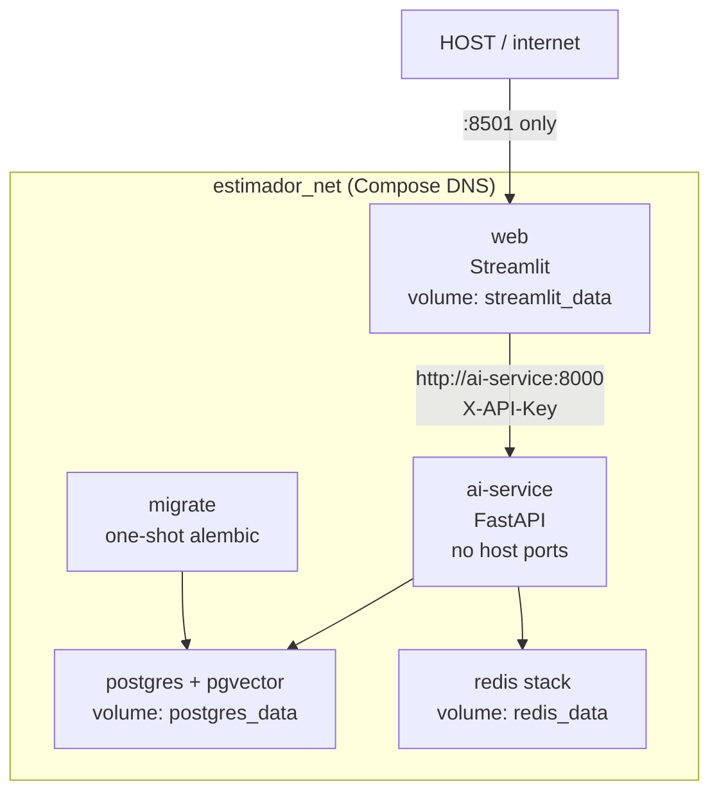

# Architecture — local production topology (Session 15)



## Layers

| Service | Role | Host ports |
| --- | --- | --- |
| `web` | Public UI + local history | `${WEB_PORT:-8501}` |
| `ai-service` | LLM / RAG / agents; holds `OPENAI_API_KEY` | none (prod-like) |
| `postgres` | Relational + vectors + LangGraph checkpoints | none (prod-like) |
| `redis` | Exact + semantic cache + activity feed | none (prod-like) |
| `migrate` | `alembic upgrade head` once per deploy | n/a |

Dev override (`docker-compose.override.yml`) re-publishes `8000`, `5433`,
`6379`, `8001` and enables bind mounts + `--reload`.

## Contract surface

Do not hand-write the AI OpenAPI: FastAPI emits `/openapi.json` and `/docs`.
In **dev** (`docker compose up`) open `http://localhost:8000/docs`. In
**prod-like** the port is closed on purpose — inspect from inside the network:

```bash
docker compose -f docker-compose.yml exec web \
  python -c "import httpx; print(httpx.get('http://ai-service:8000/openapi.json').status_code)"
```
