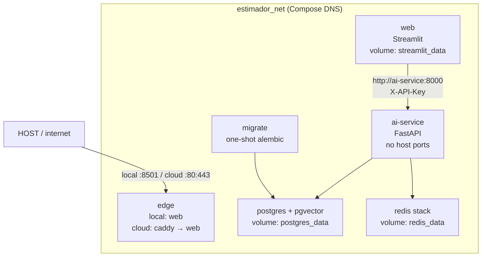

# Architecture — local production topology (Session 15)



## Who publishes a port

| Environment | Public process | Host ports | Command |
| --- | --- | --- | --- |
| Local prod-like | `web` (Streamlit) | `${WEB_PORT:-8501}` | `docker compose -f docker-compose.yml up` |
| Local dev | `web` + `ai-service` + postgres + redis | `8501`, `8000`, `5433`, `6379`, `8001` | `docker compose up` (loads override) |
| Cloud (`docker-compose.prod.yml`) | `caddy` | `80`, `443` | base + prod files; `web.ports` is `!reset []` |

Dev override (`docker-compose.override.yml`) re-publishes `8000`, `5433`,
`6379`, `8001` and enables bind mounts + `--reload`.

## Layers

| Service | Role | Host ports (prod-like) |
| --- | --- | --- |
| `caddy` | TLS + `basic_auth` (cloud only) | 80 / 443 |
| `web` | Public UI + local history | `${WEB_PORT:-8501}` locally; none in cloud |
| `ai-service` | LLM / RAG / agents; holds `OPENAI_API_KEY` | none |
| `postgres` | Relational + vectors + LangGraph checkpoints | none |
| `redis` | Exact + semantic cache + activity feed | none |
| `migrate` | `alembic upgrade head` once per deploy | n/a |

## Authentication (two layers)

1. **Global gate** — `require_service_token` (`app/api/security.py`). Every
   non-public route needs `X-API-Key` matching `AI_SERVICE_TOKEN` /
   `ESTIMATE_API_KEY` (aliases) or `RETRIEVAL_API_KEY`. Fail-closed if no
   token is configured. Public prefixes: `/health`, `/docs`, `/redoc`,
   `/openapi.json`.
2. **Router keys (Session 9)** — `require_estimate_key` vs
   `require_retrieval_key`. A valid estimate token does **not** open
   `/v1/retrieval/search`.

Consumed routes are versioned in
[`contract/web-consumed-routes.json`](contract/web-consumed-routes.json)
and checked with `uv run python scripts/check_contract.py`.

## HTTP status contract

| Code | Meaning | Retry? |
| --- | --- | --- |
| 400 | Input guardrail (moderation / injection / PII) | No — change the payload |
| 401 | Missing or wrong `X-API-Key` | No — fix the key |
| 404 | Unknown session / graph / job | No |
| 409 | Conflict: no pending gate, or duplicate ingest | No — wait for the right state |
| 415 | Unsupported attachment type | No |
| 422 | Pydantic validation | No — fix the body |
| 429 | Rate limit (`Retry-After`) | Yes, after the header |
| 500 | Genuine service failure | Maybe, once; then a runbook |
| 502 | LLM upstream failed | Yes, bounded |
| 503 | Required dependency missing (Postgres, Redis, embedder, index, OpenAI client) | Yes, after `/health/ready` is green |

## Contract surface

Do not hand-write the AI OpenAPI: FastAPI emits `/openapi.json` and `/docs`.
In **dev** (`docker compose up`) open `http://localhost:8000/docs`. In
**prod-like** the port is closed on purpose — inspect from inside the network:

```bash
docker compose -f docker-compose.yml exec web \
  python -c "import httpx; print(httpx.get('http://ai-service:8000/openapi.json').status_code)"
```
